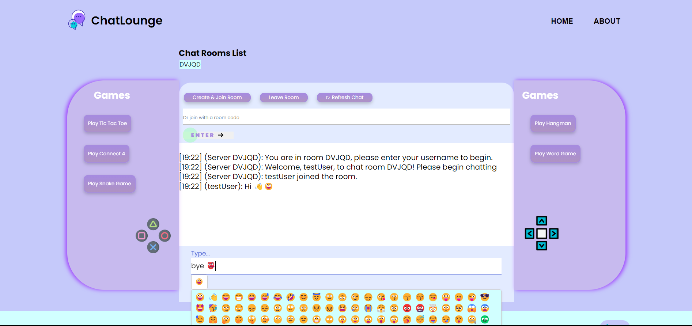

#  CHATLOUNGE - Final Project

## Project Information

### Step into ChatLounge, where gaming meets great conversation! 
ChatLounge is a robust chat server featuring multiple chat rooms and __gaming functionality__ powered by the Java WebSocket API. It facilitates seamless real-time communication among users, managing connections efficiently. Users can join existing rooms or create new ones. Moreover, users have the options to play games: Tic Tac Toe and a Word game.

Each chat room has a unique code for separate discussions. The server handles user authentication and authorization. Upon entering a room, users provide a username, receive a welcome message, and can exchange messages with timestamps.

### Games: In Tic Tac Toe, users select emojis as players and can send reaction emojis. Winning triggers a celebratory animation. In the Word game, users decipher scrambled words and submit guesses for victory. Multiple rounds ensure continuous engagement.

### This endeavor is the result of a collaborative effort harnessing the collective expertise of Zara Farrukh, Rabia Chattha, Syeda Bisha Fatima, and Manal Afzal.

ADD DEMO VIDEO AND MORE SCREENSHOTS HERE:

   

## Key Features
- Seamless chat refreshing functionality to ensure the latest conversations are readily available.
- Robust chatroom history preservation, allowing users to access past discussions effortlessly.
- Advanced error handling mechanisms designed to promptly alert users and guide them through the web application for enhanced user experience.
- Convenient "Scroll to Top" feature for effortless navigation within the chat interface.
- Broadcast User Entrance/Exits to rest of the users in the chatroom.
- The chat now includes an emoji selection functionality, allowing users to easily insert emojis into their messages, thereby enhancing expressiveness and communication.
- The games feature seamlessly integrated animations, elevating the visual aesthetics and greater user engagement
- The implementation of "Play Again" functionalities empowers users to extend their gaming experiences, fostering prolonged enjoyment and maximizing user retention.
- In Tic Tac Toe, users can select emojis as avatars from a comprehensive emoji selection interface, enriching their gaming experience with an interactive and enjoyable element, thus enhancing overall engagement.

  
## How to Run

### Step-by-Step Instructions:
1. Clone the repository: `git clone https://github.com/OntarioTech-CS-program/w24-csci2020u-final-project-chattha-farrukh-fatima-afzal.git`
2. Launch intelliJ IDEA ULTIMATE and navigate to project directory
3. Configure Glassfish and edit Run Configurations
    - Set default URL as `http://localhost:8080/WSChatServer-1.0-SNAPSHOT/`
4. Start GlassFish server and deploy application on selecting ▶

## Other Resources
[1] CSCI2020U - Assignment 2: ChatLounge
  - `[https://github.com/OntarioTech-CS-program/ChatServer](https://github.com/OntarioTech-CS-program/w24-csci2020u-assignment02-afzal-chattha-farrukh-fatima)`

[2] Font: [Google Fonts - Poppins](https://fonts.google.com/specimen/Poppins)

[3] Font Awesome Icons: [Font Awesome](https://fontawesome.com/)
- The application uses Font Awesome icons for enhanced visual elements. You can explore and customize the available icons on the Font Awesome website: [Font Awesome Icons](https://fontawesome.com/icons)
